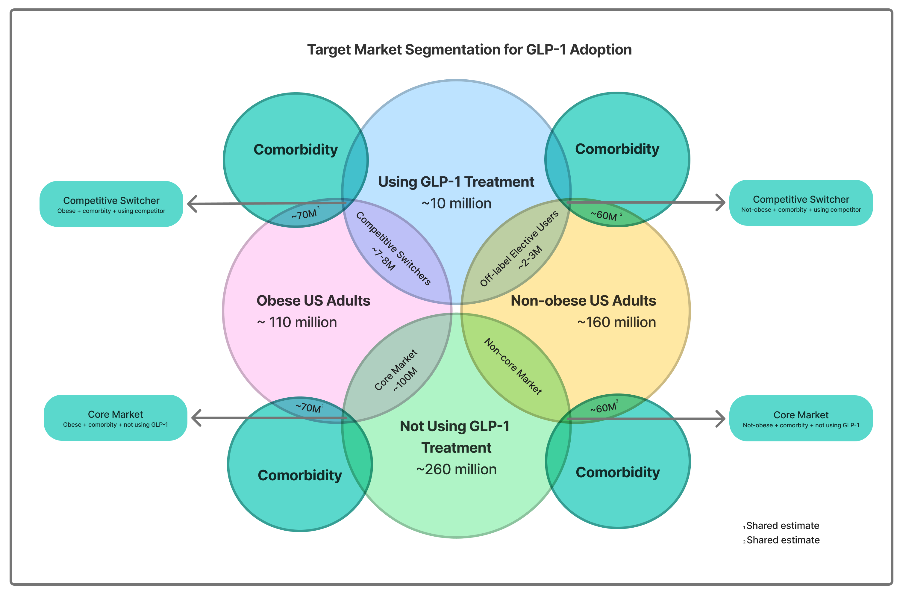

::: text-center
{width="180px"}
:::

---
title: "Rabivy Propensity Modelling"
author: "Tilabo Williamson, Caitlin Buenk & Jürgen Becker (Project Lead) - AX Consult Group"
date: "2026-06-17"
format:
  html:
    theme: cosmo
    code-fold: true
    code-summary: "Show code"
    code-tools: true
    toc: true
    embed-resources: true
editor: 
  markdown: 
    wrap: 72
execute:
  freeze: auto
---

```{r packages}
#| include: false
library(pacman)
p_load(magrittr, tidyverse, psych, dplyr, prettydoc, haven, janitor, readxl, writexl, stringr, here, purrr, tibble, ggplot2, kableExtra, corrplot, pROC, brm)
```

```{r plotting-setup}
#| include: false
rabivy_theme <- theme(
  plot.background  = element_rect(fill = "#FFFFFF", color = NA),
  panel.background = element_rect(fill = "#FFFFFF", color = NA),
  panel.grid.major = element_line(color = "#E5E5E8", linewidth = 0.3),
  panel.grid.minor = element_blank(),
  text             = element_text(color = "#000000", family = "sans"),
  axis.text        = element_text(color = "#1A1A1A"),
  axis.title       = element_text(color = "#000000", face = "bold"),
  plot.title       = element_text(color = "#000000", face = "bold", size = 16),
  plot.subtitle    = element_text(color = "#4A4A4A", size = 11),
  legend.background = element_rect(fill = "#FFFFFF"),
  legend.key       = element_rect(fill = "#FFFFFF"),
  legend.text      = element_text(color = "#000000"),
  legend.title     = element_text(color = "#000000")
)

rabivy_violet <- "#7F77DD"
rabivy_palette <- c("#7F77DD", "#B5AFEB", "#3D3870", "#E8E5FA", "purple")
rabivy_palette_categorical <- c("#311465", "#8B008B", "#A45EE9")
```

# Introduction

Phase 2 builds a propensity model to predict which healthcare
practitioners (HCPs)s are most likely to prescribe Rabivy. The score
used HCP-level features across three data domains: prescription activity
(IQVIA/Symphony Health), payer and access dynamics (Komodo/Optum), and
AX Pharmaceuticals rep engagement history (Veeva/CRM).

As Rabivy has not yet launched, no real-world prescribing data exists.
The dataset used here is fully synthetic, simulated to reflect realistic
HCP behaviour patterns observed in analogous GLP-1 launches - including
semaglutide (Ozempic/Wegovy) and tirzepatide (Mounjaro/Zepbound).
Variable distributions, specialty mix, and payer dynamics are calibrated
to published market data and real-world launch benchmarks.

## Simulation

### Variable 1 - HCP Specialty

Specialty is the foundational variable in the simulation; all downstream
variables (payer mix, formulary access, prior auth burden) are drawn
conditional on it. Three prescriber types are included: Primary Care,
Endocrinology, and Obesity Medicine.

Probabilities are calibrated to real-world GLP-1 prescribing data from
analogous launches (semaglutide/Wegovy, tirzepatide/Zepbound). BCBS Blue
Health Intelligence analysis of weight-management GLP-1 prescriptions
found that fewer than 10% of scripts were written by endocrinologists
and obesity medicine specialists combined, with the large majority
originating from primary care settings. A Northwestern Medicine
longitudinal study found primary care's share of first-time GLP-1
prescriptions grew from 8% in 2013 to 57% by 2019 — a trend that has
continued. Obesity medicine remains a small but high-value segment given
superior patient persistence rates.

**Assumptions:** Primary Care 82% / Endocrinology 10% / Obesity Medicine
8%

Sources:

BCBS Blue Health Intelligence (2023). Real-world trends in GLP-1
treatment persistence.
https://www.bcbs.com/media/pdf/BHI_Issue_Brief_GLP1_Trends.pdf

Jiang et al. (2023). First-time prescriber rates for GLP-1 receptor
agonists by clinical specialty. PMC9908071.
https://pmc.ncbi.nlm.nih.gov/articles/PMC9908071

```{r V1-hcp-specialty-simulation}
set.seed(43)
n <- 15000

# V1: HCP Specialty
specialty <- sample(
  c("Primary Care", "Endocrinology", "Obesity Medicine"),
  size = n,
  replace = TRUE,
  prob = c(0.82, 0.10, 0.08)
)

# NPI — unique 10-digit numbers starting with 1
npi <- as.character(sample(1000000000:1999999999, n, replace = FALSE))

hcp_df <- data.frame(
  hcp_id    = sprintf("HCP%04d", 1:n),
  npi       = npi,
  specialty = specialty
)

# Check
table(hcp_df$specialty) / n
```

```{r specialty}
ggplot(hcp_df, aes(x = specialty, fill = specialty)) +
  geom_bar() +
  scale_fill_manual(values = rabivy_palette[1:3]) +
  labs(title = "HCPs Specialty Breakdown",
       subtitle = "Spread of HCPs across the various specialties",
       x = NULL, y = "Count") +
  rabivy_theme +
  theme(legend.position = "none")
```

### Variable 2 - Monthly GLP-1 Rx Volume per HCP

Total GLP-1 scripts written per HCP per month across all brands. Drawn
from a negative binomial distribution, which captures the characteristic
right-skew of prescriber volume: most writers are low-frequency, with a
small tail of high-volume prescribers.

Average volume differs by specialty to reflect how concentrated each
doctor's patient panel is around GLP-1-eligible patients. Obesity
medicine specialists are assumed to write the most (**assumption** -\>
mean \~60/month), as nearly their entire practice is weight-management
focused. Endocrinologists sit in the middle (**assumption** -\> mean
\~35/month), prescribing for both diabetes and obesity. Primary care
doctors write the fewest individually (**assumption** -\> mean
\~12/month), though they make up the bulk of the prescriber population.
These figures are assumptions - per-HCP volume data is proprietary to
IQVIA Xponent and not publicly reported.

Approximately 60% of primary care HCPs in the simulation are
zero-writers - this is an **assumption** - they hold a relevant
specialty but have not yet adopted GLP-1 prescribing. Endocrinologists
and obesity medicine specialists are excluded from zero-inflation, as
they are highly likely to prescribe GLP-1s given their patient
population.

**Assumptions:** mean scripts/month by specialty - Obesity Med \~60,
Endo \~35, Primary Care \~12; zero-inflated at 60% for primary care HCPs
only.

```{r V2-Rx-volume-simulation}
# V2: Monthly GLP-1 Rx Volume (zero-inflated negative binomial, by specialty)

# Zero-writer flag: conditional on specialty (PCPs only)
hcp_df$zero_writer <- as.logical(
  rbinom(n, size = 1, prob = ifelse(hcp_df$specialty == "Primary Care", 0.6, 0))
)

# Mu conditional on specialty - reflects patient panel concentration
mu_by_specialty <- ifelse(
  hcp_df$specialty == "Obesity Medicine", 60,
  ifelse(hcp_df$specialty == "Endocrinology", 35, 12)
)

rx_volume_raw <- rnbinom(n, mu = mu_by_specialty, size = 1.5)
hcp_df$rx_volume_monthly <- ifelse(hcp_df$zero_writer, 0, rx_volume_raw)

# Standardize rx_volume_monthly to comparable scale (z-score)
hcp_df$rx_volume_z <- scale(hcp_df$rx_volume_monthly)[,1]

# Check
summary(hcp_df$rx_volume_monthly)
mean(hcp_df$zero_writer)
tapply(hcp_df$rx_volume_monthly, hcp_df$specialty, summary)
```

```{r V1-scripts-by-specialty-plot}
ggplot(hcp_df[!hcp_df$zero_writer, ], aes(x = specialty, y = rx_volume_monthly, fill = specialty)) +
  geom_boxplot(outlier.alpha = 0.3) +
  scale_fill_manual(values = setNames(rabivy_palette_categorical,
                     c("Primary Care", "Endocrinology", "Obesity Medicine"))) +
  labs(title = "Monthly Script Volume by Specialty",
       subtitle = "Active writers only (excludes zero-writers)",
       x = NULL, y = "Monthly GLP-1 Scripts") +
  rabivy_theme +
  theme(legend.position = "none")
```

### Variable 3 - NRx Share (new patient starts as proportion of total GLP-1 scripts)

This measures what share of an HCP's GLP-1 prescriptions are for new
patients starting treatment, versus existing patients on repeat scripts.
Most active prescribers are mainly managing existing patients, with a
smaller flow of new starts each month - so the simulation assumes around
25% new starts on average, with some variation across doctors. This
figure is a calibrated assumption rather than one taken directly from
published data, as HCP-level new-start ratios are not publicly reported.
Doctors who write zero GLP-1 scripts are assigned zero new starts too.

**Assumptions:** \~25% new starts on average; conservative given rising
market trend; zero for non-writers.

```{r V3-NRx-share-simulation}
# V3: NRx Share

nrx_share_raw <- rbeta(n, shape1 = 2, shape2 = 6)
hcp_df$nrx_share <- ifelse(hcp_df$zero_writer, 0, nrx_share_raw)

# Derived: absolute NRx count
hcp_df$nrx_monthly <- round(hcp_df$rx_volume_monthly * hcp_df$nrx_share)

# Check
summary(hcp_df$nrx_share[!hcp_df$zero_writer])
```

```{r V3-nRx-share-distribution-plot}
ggplot(hcp_df[!hcp_df$zero_writer, ], aes(x = nrx_share)) +
  geom_histogram(fill = "#7F77DD", bins = 30, color = "#FFFFFF", linewidth = 0.2) +
  labs(title = "Distribution of New-Start Share",
       subtitle = "Across all active GLP-1 prescribers",
       x = "NRx Share", y = "Number of HCPs") +
  rabivy_theme
```

```{r V3-total-scripts-vs-new-scripts-plot}
ggplot(hcp_df[!hcp_df$zero_writer, ], aes(x = rx_volume_monthly, y = nrx_share, color = specialty)) +
  geom_point(alpha = 0.5, size = 1.3) +
  scale_color_manual(values = setNames(rabivy_palette_categorical,
                      c("Primary Care", "Endocrinology", "Obesity Medicine"))) +
  labs(title = "Volume vs. New-Start Share, by Specialty",
       subtitle = "Are high-volume writers also high new-start writers?",
       x = "Monthly GLP-1 Scripts", y = "NRx Share (New Starts)", color = "Specialty") +
  rabivy_theme
```

### Variable 4 - Payer Mix

Captures what share of an HCP's GLP-1 patients fall into each payer
category: Commercial, Medicare, Medicaid, or out-of-pocket. This is
conditional on specialty, reflecting differences in typical patient
population - obesity medicine clinics see more cash-pay patients, while
primary care serves a broader payer mix including more government
insurance.

These figures are educated **assumptions**, set against a backdrop of
real but shifting policy: Medicaid coverage of GLP-1s for obesity is
currently optional and has been narrowing (13 states covering as of
January 2026, down from 16 in 2025), while a new Medicare GLP-1 Bridge
demonstration program is set to begin in July 2026, temporarily opening
limited obesity-indication coverage. This volatility means payer mix at
Rabivy's eventual launch is genuinely uncertain and should be
revisited closer to launch.

**Assumptions:** Commercial/Medicare/Medicaid/OOP - Primary Care
30/40/20/10, Endocrinology 50/30/12/8, Obesity Medicine 55/18/7/20.

```{r V4-payer-mix-simulation}
# V4: Payer Mix (Commercial, Medicare, Medicaid, OOP), conditional on specialty

payer_probs <- list(
  "Primary Care"     = c(Commercial = 0.30, Medicare = 0.40, Medicaid = 0.20, OOP = 0.10),
  "Endocrinology"    = c(Commercial = 0.50, Medicare = 0.30, Medicaid = 0.12, OOP = 0.08),
  "Obesity Medicine" = c(Commercial = 0.55, Medicare = 0.18, Medicaid = 0.07, OOP = 0.20)
)

payer_mix <- t(sapply(hcp_df$specialty, function(sp) {
  rmultinom(1, size = 100, prob = payer_probs[[sp]]) / 100
}))

colnames(payer_mix) <- c("pct_commercial", "pct_medicare", "pct_medicaid", "pct_oop")
hcp_df <- cbind(hcp_df, payer_mix)

# Check
aggregate(cbind(pct_commercial, pct_medicare, pct_medicaid, pct_oop) ~ specialty, data = hcp_df, mean)
```

```{r V4-payer-mix-plot}

# Reshape payer mix to long format for plotting
payer_long <- hcp_df %>%
  group_by(specialty) %>%
  summarise(
    Commercial = mean(pct_commercial),
    Medicare   = mean(pct_medicare),
    Medicaid   = mean(pct_medicaid),
    OOP        = mean(pct_oop)
  ) %>%
  pivot_longer(cols = -specialty, names_to = "payer_type", values_to = "avg_share")

ggplot(payer_long, aes(x = specialty, y = avg_share, fill = payer_type)) +
  geom_bar(stat = "identity", position = "stack") +
  scale_fill_manual(values = setNames(c("#7F77DD", "#5A52B8", "#3D3870", "#B5AFEB"),
                     c("Commercial", "Medicare", "Medicaid", "OOP"))) +
  labs(title = "Payer Mix by Specialty",
       subtitle = "Average share of Commercial, Medicare, Medicaid, and OOP patients",
       x = NULL, y = "Average Share", fill = "Payer Type") +
  rabivy_theme
```

### Variable 5 - Formulary Coverage Score

This represents Rabivy's likely formulary tier given the dominant
payer type for each HCP's patient panel: Preferred (no friction),
Non-preferred (cost-share barrier), Prior Authorization required
(time/effort barrier), or Not covered (effectively blocked).

These are educated assumptions, deliberately stricter for Medicare and
Medicaid, reflecting the current policy reality: obesity coverage is not
yet standard for either program. OOP patients face no formulary barrier.

**Assumptions:** Preferred/Non-preferred/PA/Not covered - Commercial
35/35/25/5, Medicare 5/15/30/50, Medicaid 3/10/22/65, OOP 100/0/0/0.

```{r V5-formulary-coverage-simulation}
# V5: Formulary Coverage Score, conditional on dominant payer

formulary_probs <- list(
  Commercial = c(Preferred = 0.35, NonPreferred = 0.35, PARequired = 0.25, NotCovered = 0.05),
  Medicare   = c(Preferred = 0.05, NonPreferred = 0.15, PARequired = 0.30, NotCovered = 0.50),
  Medicaid   = c(Preferred = 0.03, NonPreferred = 0.10, PARequired = 0.22, NotCovered = 0.65),
  OOP        = c(Preferred = 1.00, NonPreferred = 0,    PARequired = 0,    NotCovered = 0)
)

# Determine dominant payer per HCP
payer_cols <- c("pct_commercial", "pct_medicare", "pct_medicaid", "pct_oop")
payer_names <- c("Commercial", "Medicare", "Medicaid", "OOP")
hcp_df$dominant_payer <- payer_names[apply(hcp_df[, payer_cols], 1, which.max)]

hcp_df$formulary_tier <- sapply(hcp_df$dominant_payer, function(p) {
  sample(names(formulary_probs[[p]]), size = 1, prob = formulary_probs[[p]])
})

# Check
table(hcp_df$dominant_payer, hcp_df$formulary_tier)
```

```{r V5-formulary-access-plot}
ggplot(hcp_df, aes(x = dominant_payer, fill = formulary_tier)) +
  geom_bar(position = "fill") +
  scale_fill_manual(values = setNames(c("#B5AFEB", "#7F77DD", "#5A52B8", "#3D3870"),
                     c("Preferred", "NonPreferred", "PARequired", "NotCovered"))) +
  labs(title = "Formulary Access by Dominant Payer",
       subtitle = "Share of HCPs at each formulary tier, by payer type",
       x = NULL, y = "Share of HCPs", fill = "Formulary Tier") +
  rabivy_theme
```

### Variable 6 - Prior Authorization Burden

Estimates the likelihood that a GLP-1 prescription requires prior
authorization, based on the HCP's dominant payer type. Drawn from a Beta
distribution per payer, which captures realistic variation in PA burden
rather than a single fixed rate.

These are educated assumptions: Medicare and Medicaid are weighted
toward higher PA burden, consistent with the current obesity-coverage
landscape where both programs only recently began (or are about to
begin) covering GLP-1s for obesity, typically with strict gatekeeping.
Out-of-pocket patients face no PA burden.

**Assumptions:** PA rate (mean) - Commercial \~40%, Medicare \~55%,
Medicaid \~60%, OOP 0%.

```{r V6-prioir-auth-simulation}
# V6: Prior Auth Burden, conditional on dominant payer

pa_params <- list(
  Commercial = c(shape1 = 4,   shape2 = 6),
  Medicare   = c(shape1 = 5.5, shape2 = 4.5),
  Medicaid   = c(shape1 = 6,   shape2 = 4),
  OOP        = c(shape1 = 0,   shape2 = 0)  
)

hcp_df$pa_burden <- mapply(function(payer) {
  if (payer == "OOP") return(0)
  p <- pa_params[[payer]]
  rbeta(1, shape1 = p["shape1"], shape2 = p["shape2"])
}, hcp_df$dominant_payer)

# Sanity check
aggregate(pa_burden ~ dominant_payer, data = hcp_df, mean)
```

```{r V6-prior-auth-plot}
ggplot(hcp_df, aes(x = dominant_payer, y = pa_burden, fill = dominant_payer)) +
  geom_boxplot(outlier.alpha = 0.3) +
  scale_fill_manual(values = setNames(c("#7F77DD", "#5A52B8", "#3D3870", "#B5AFEB"),
                     c("Commercial", "Medicare", "Medicaid", "OOP"))) +
  labs(title = "Prior Auth Burden by Dominant Payer",
       subtitle = "Distribution of PA burden scores across payer types",
       x = NULL, y = "PA Burden Score") +
  rabivy_theme +
  theme(legend.position = "none")
```

### Variable 7 - Existing AX Pharmaceuticals Relationship Score

Captures whether an HCP has prescribed any AX Pharmaceuticals product
in the last 24 months - a proxy for existing trust and familiarity.
Three categories: no AX Pharmaceuticals history (cold start), one product (narrow
relationship), or two or more products (embedded in the AX Pharmaceuticals
ecosystem).

This is a pure internal assumption - AX Pharmaceutical's actual rep relationship and
prior-product history lives in CRM/Veeva data, which isn't publicly
available. The distribution is conditional on specialty: Repatha is a
cardiometabolic drug, so primary care and endocrinology - who manage
cardiovascular risk more broadly - are assumed to have higher prior
AX Pharmaceuticals exposure than obesity medicine.

**Assumptions:** No history/One product/Two+ - Primary Care 40/38/22,
Endocrinology 35/40/25, Obesity Medicine 65/25/10.

```{r V7-ax-relationship-simulation}
# V7: Existing AX Pharmaceuticals Relationship Score, conditional on specialty

ax_probs <- list(
  "Primary Care"     = c(None = 0.40, One = 0.38, TwoPlus = 0.22),
  "Endocrinology"    = c(None = 0.35, One = 0.40, TwoPlus = 0.25),
  "Obesity Medicine" = c(None = 0.65, One = 0.25, TwoPlus = 0.10)
)

hcp_df$ax_relationship <- sapply(hcp_df$specialty, function(sp) {
  sample(names(ax_probs[[sp]]), size = 1, prob = ax_probs[[sp]])
})

# Sanity check
table(hcp_df$specialty, hcp_df$ax_relationship)
```

```{r V7-ax-relationship-plot}
ggplot(hcp_df, aes(x = specialty, fill = factor(ax_relationship, levels = c("None", "One", "TwoPlus")))) +
  geom_bar(position = "fill") +
  scale_fill_manual(values = setNames(c("#3D3870", "#7F77DD", "#B5AFEB"),
                     c("None", "One", "TwoPlus"))) +
  labs(title = "Existing AX Pharmaceuticals Relationship by Specialty",
       subtitle = "Share of HCPs with prior AX Pharmaceuticals product history",
       x = NULL, y = "Share of HCPs", fill = "AX Pharmaceuticals Relationship") +
  rabivy_theme
```

### Variable 8 - Rep Engagement Recency

Captures how recently an AX Pharmaceuticals rep has engaged with this HCP, decayed
over time - a recent contact carries a strong signal, a contact six
months ago carries almost none. Targeting status is now conditional on
two factors: prescribing volume (reps prioritize high-volume writers)
and existing AX Pharmaceuticals relationship (reps prioritize warmer, pre-existing
relationships). HCPs ranking high on both are most likely to be actively
targeted; cold, low-volume HCPs are least likely.

Days since last contact are drawn from an Exponential distribution -
targeted HCPs average \~30 days since contact, non-targeted HCPs average
\~120 days. This is converted to a decay score (0.97\^days), so very
recent contact scores near 1, and contact from months ago decays toward
0.

This is a pure internal assumption - actual Veeva/CRM rep engagement
data isn't publicly available, but the logic that targeting follows
volume and relationship strength is a reasonable commercial behavior
pattern.

**Assumptions:** Targeting probability scaled by volume percentile +
AX Pharmaceuticals relationship tier; targeted mean 30 days since contact,
non-targeted mean 120 days; decay rate 0.97 per day.

```{r V8-engagement-recency-simulation}
# V8: Rep Engagement Recency, conditional on volume + AX Pharmaceuticals relationship

# Build a targeting score: volume percentile + relationship tier
volume_pctile <- rank(hcp_df$rx_volume_monthly) / n

relationship_weight <- ifelse(
  hcp_df$ax_relationship == "TwoPlus", 1.0,
  ifelse(hcp_df$ax_relationship == "One", 0.5, 0)
)

targeting_score <- 0.6 * volume_pctile + 0.4 * relationship_weight

# Convert score to targeting probability (calibrated so ~40% end up targeted)
targeting_prob <- targeting_score / max(targeting_score) * 0.7  # scaling factor tuned for ~40% targeted
hcp_df$targeted <- rbinom(n, size = 1, prob = targeting_prob)

# Days since last contact, conditional on targeted status
hcp_df$days_since_contact <- ifelse(
  hcp_df$targeted == 1,
  rexp(n, rate = 1/30),
  rexp(n, rate = 1/120)
)

# Decay score
hcp_df$rep_engagement_score <- 0.97 ^ hcp_df$days_since_contact

# Sanity check
mean(hcp_df$targeted)
aggregate(rep_engagement_score ~ targeted, data = hcp_df, mean)
```

```{r V8-engagement-decay-plot}
decay_df <- data.frame(days = 0:180)
decay_df$score <- 0.97 ^ decay_df$days

ggplot(decay_df, aes(x = days, y = score)) +
  geom_line(color = "#7F77DD", linewidth = 1.2) +
  geom_vline(xintercept = 30, linetype = "dashed", color = "#5A52B8") +
  geom_vline(xintercept = 120, linetype = "dashed", color = "#3D3870") +
  annotate("text", x = 30, y = 0.9, label = "Targeted\navg: 30 days", color = "#5A52B8", size = 3, hjust = -0.1) +
  annotate("text", x = 120, y = 0.9, label = "Non-targeted\navg: 120 days", color = "#3D3870", size = 3, hjust = -0.1) +
  labs(title = "Rep Engagement Decay Over Time",
       subtitle = "Score = 0.97^days since last contact",
       x = "Days Since Last Contact", y = "Engagement Score") +
  rabivy_theme
```

```{r V8-rep-engagement-plot}
ggplot(hcp_df, aes(x = factor(targeted, labels = c("Not Targeted", "Targeted")), 
                    y = rep_engagement_score, fill = factor(targeted))) +
  geom_boxplot(outlier.alpha = 0.3) +
  scale_fill_manual(values = c("0" = "#3D3870", "1" = "#7F77DD")) +
  labs(title = "Rep Engagement Score by Targeting Status",
       subtitle = "Targeted HCPs show stronger, more recent rep contact",
       x = NULL, y = "Rep Engagement Score") +
  rabivy_theme +
  theme(legend.position = "none")
```

### Variable 9 - Competitor Brand Mix

This captures the current GLP-1 brand landscape - specifically, what
share of their existing GLP-1 patients are on Novo Nordisk products
(Ozempic/Wegovy) versus Eli Lilly products (Mounjaro/Zepbound) versus
other brands. This matters for identifying switching opportunities:
doctors with patients heavily concentrated on a single competitor brand
represent a different commercial target than doctors actively starting
new, brand-undecided patients. **Especially given Rabivy's monthly
injection benefit.**

Market share figures are calibrated assumptions, anchored to recent
published estimates, though current reporting varies meaningfully by
source and methodology (revenue share vs. volume share, and the market
is shifting quickly between the two main competitors). We use a
simplified three-way split: Novo Nordisk \~54%, Eli Lilly \~35%, Other
\~11%.

**Assumptions:** Brand mix per HCP drawn from a multinomial distribution
at the market-level split (Novo 54% / Lilly 35% / Other 11%), applied
uniformly across specialties as a starting assumption.

```{r V9-competitor-bran-mix-simulation}
# V9: Competitor Brand Mix

brand_probs <- c(NovoNordisk = 0.54, EliLilly = 0.35, Other = 0.11)

brand_mix <- t(sapply(1:n, function(i) {
  rmultinom(1, size = 100, prob = brand_probs) / 100
}))

colnames(brand_mix) <- c("pct_novo", "pct_lilly", "pct_other_brand")
hcp_df <- cbind(hcp_df, brand_mix)

# Derived: dominant competitor brand per HCP
brand_cols <- c("pct_novo", "pct_lilly", "pct_other_brand")
brand_names <- c("Novo Nordisk", "Eli Lilly", "Other")
hcp_df$dominant_competitor <- brand_names[apply(hcp_df[, brand_cols], 1, which.max)]

# Check
table(hcp_df$dominant_competitor)
colMeans(hcp_df[, brand_cols])
```

```{r V9-competitor-mix-plot}
# Reshape payer mix to long format for plotting
competitor_long <- hcp_df %>%
  group_by(specialty) %>%
  summarise(
    Novo_Nordisk = mean(pct_novo),
    Eli_Lilly    = mean(pct_lilly),
    Other        = mean(pct_other_brand)
  ) %>%
  pivot_longer(cols = -specialty,
               names_to = "competitor_type",
               values_to = "avg_share")


ggplot(competitor_long, aes(x = specialty, y = avg_share, fill = competitor_type)) +
  geom_bar(stat = "identity", position = "stack") +
  scale_fill_manual(values = setNames(c("#7F77DD", "#5A52B8", "#3D3870", "#B5AFEB"),
                     c("Novo_Nordisk", "Eli_Lilly", "Other"))) +
  labs(title = "Competitor Brand by Specialty",
       subtitle = "Which company currently leads each doctor's GLP-1 patient panel",
       x = NULL, y = "Average Share", fill = "Competitor Brand") +
  rabivy_theme
```

### Variable 10 - HCP Geographic Region

xxx

**Assumptions:** xxx


```{r V10-hcp-region}
# V10: Geographic Region - by State

state_physician_counts <- c(
  "california"       = 109000,
  "texas"            = 76000,
  "new york"         = 89000,
  "florida"          = 68000,
  "pennsylvania"     = 48000,
  "illinois"         = 44000,
  "ohio"             = 40000,
  "michigan"         = 34000,
  "massachusetts"    = 38000,
  "new jersey"       = 33000,
  "georgia"          = 28000,
  "north carolina"   = 29000,
  "virginia"         = 27000,
  "washington"       = 24000,
  "arizona"          = 22000,
  "colorado"         = 20000,
  "maryland"         = 24000,
  "tennessee"        = 20000,
  "minnesota"        = 20000,
  "wisconsin"        = 18000,
  "missouri"         = 18000,
  "indiana"          = 17000,
  "oregon"           = 15000,
  "connecticut"      = 15000,
  "south carolina"   = 14000,
  "alabama"          = 13000,
  "louisiana"        = 13000,
  "kentucky"         = 12000,
  "oklahoma"         = 11000,
  "iowa"             = 10000,
  "utah"             = 10000,
  "kansas"           = 9000,
  "nevada"           = 9000,
  "arkansas"         = 8000,
  "mississippi"      = 7000,
  "new mexico"       = 7000,
  "nebraska"         = 7000,
  "west virginia"    = 6000,
  "hawaii"           = 6000,
  "new hampshire"    = 5000,
  "maine"            = 5000,
  "rhode island"     = 5000,
  "idaho"            = 5000,
  "montana"          = 4000,
  "delaware"         = 4000,
  "south dakota"     = 3000,
  "north dakota"     = 3000,
  "alaska"           = 3000,
  "vermont"          = 3000,
  "wyoming"          = 2000
)

# Convert to probabilities
state_probs <- state_physician_counts / sum(state_physician_counts)

hcp_df$state <- sample(
  names(state_probs),
  size = nrow(hcp_df),
  replace = TRUE,
  prob = state_probs
)

# Derive region from state for any downstream use
state_to_region <- c(
  "connecticut" = "Northeast", "maine" = "Northeast", "massachusetts" = "Northeast",
  "new hampshire" = "Northeast", "rhode island" = "Northeast", "vermont" = "Northeast",
  "new jersey" = "Northeast", "new york" = "Northeast", "pennsylvania" = "Northeast",
  "illinois" = "Midwest", "indiana" = "Midwest", "michigan" = "Midwest",
  "ohio" = "Midwest", "wisconsin" = "Midwest", "iowa" = "Midwest",
  "kansas" = "Midwest", "minnesota" = "Midwest", "missouri" = "Midwest",
  "nebraska" = "Midwest", "north dakota" = "Midwest", "south dakota" = "Midwest",
  "delaware" = "South", "florida" = "South", "georgia" = "South",
  "maryland" = "South", "north carolina" = "South", "south carolina" = "South",
  "virginia" = "South", "west virginia" = "South", "alabama" = "South",
  "kentucky" = "South", "mississippi" = "South", "tennessee" = "South",
  "arkansas" = "South", "louisiana" = "South", "oklahoma" = "South",
  "texas" = "South",
  "arizona" = "West", "colorado" = "West", "idaho" = "West",
  "montana" = "West", "nevada" = "West", "new mexico" = "West",
  "utah" = "West", "wyoming" = "West", "alaska" = "West",
  "california" = "West", "hawaii" = "West", "oregon" = "West",
  "washington" = "West"
)

hcp_df$region <- state_to_region[hcp_df$state]

# Checks
table(hcp_df$state) / n
table(hcp_df$region) / n
```
### Variable 11 - Years in Practice 
Years in practice serves as a stratifying variable rather than a primary driver of Rabivy prescribing. More experienced HCPs may be slower to adopt new therapies relative to younger colleagues. We would expect a modest negative association with early Rabivy uptake after controlling for volume, access, and clinical eligibility.

This variable is simulated from a normal distribution truncated between 5 and 40 years to reflect realistic physician career lengths. No strong specialty gradient is imposed because the effect is expected to operate similarly across primary care, endocrinology, and obesity medicine once other factors are held constant.

**Assumptions:** Mean 18 years (SD 8), truncated 5–40 years; slight negative effect on propensity after adjustment for volume and access.

```{r V11-years-in-practice}
# V11: Years in Practice 
hcp_df$years_practice <- pmax(5, pmin(40, round(rnorm(n, mean = 18, sd = 8))))

ggplot(hcp_df, aes(x = years_practice, fill = specialty)) +
  geom_density(alpha = 0.55, adjust = 1.1) +
  scale_fill_manual(values = rabivy_palette[1:3]) +
  labs(title = "Distribution of Years in Practice by Specialty",
       subtitle = "Stratifying variable with modest expected negative effect on early adoption",
       x = "Years in Practice", y = "Density", fill = "Specialty") +
  rabivy_theme +
  theme(legend.position = "right")
```
### Variable 12 - Obesity Prevalence
Obesity prevalence in a HCP’s patient panel is one of the strongest clinical signals of Rabivy eligibility. HCPs whose panels contain a high proportion of patients with obesity have a much larger addressable population for a new obesity-indicated GLP-1. 

This variable is simulated conditional on specialty to reflect real differences in patient mix: obesity medicine specialists see the highest concentration, followed by endocrinologists, with primary care showing the broadest but lower average prevalence.

Higher obesity prevalence is expected to be a major positive driver of Rabivy prescribing propensity, especially when combined with high new-start volume and favourable access. This variable captures the core clinical opportunity that commercial targeting models must identify.

**Assumptions:** Beta distribution with specialty-specific means (Obesity Medicine 68%, Endocrinology 42%, Primary Care 22%); values truncated 8–92% for realism.

```{r V12-obesity-prevalence}
# V12: Obesity Prevalence
ob_prev_mean <- ifelse(
  hcp_df$specialty == "Obesity Medicine", 0.68,
  ifelse(hcp_df$specialty == "Endocrinology", 0.42, 0.22)
)
hcp_df$obesity_prev <- rbeta(n, shape1 = ob_prev_mean * 9, shape2 = (1 - ob_prev_mean) * 9)
hcp_df$obesity_prev <- pmax(0.08, pmin(0.92, hcp_df$obesity_prev))

ggplot(hcp_df, aes(x = specialty, y = obesity_prev, fill = specialty)) +
  geom_boxplot(outlier.alpha = 0.25) +
  scale_fill_manual(values = rabivy_palette[1:3]) +
  labs(title = "Obesity Prevalence in Patient Panel by Specialty",
       subtitle = "Major positive driver of Rabivy prescribing propensity",
       x = NULL, y = "Obesity Prevalence", fill = "Specialty") +
  rabivy_theme +
  theme(legend.position = "none")
```
### Variable 13 - Recent Sample Request (Active Interest Proxy) 
A recent sample request is used as a behavioral proxy for active interest and intent to trial a new therapy. HCPs who request samples, especially for a new cardiometabolic asset, signal both familiarity with the product class and willingness to initiate patients. This variable is generated with higher probability among targeted HCPs and high-volume writers, reflecting realistic rep-driven and self-driven interest patterns observed in prior GLP-1 launches.

In the propensity model, recent sample requests are expected to exert a positive but secondary effect - amplifying the signal from high volume, good access, and high obesity prevalence rather than acting as a standalone driver.

**Assumptions:** Probability increases with targeting status and monthly GLP-1 volume; overall rate ~35–40% of HCPs show a recent request.

```{r V13-recent-sample-request}
# V13: Recent Sample Request 
# Binary proxy for active interest / intent to trial) 

sample_prob <- pmax(0.08, pmin(0.82, 
  0.22 + 0.35 * hcp_df$targeted + 0.28 * scale(hcp_df$rx_volume_monthly)[,1]))
hcp_df$sample_request_recent <- rbinom(n, 1, prob = sample_prob)

ggplot(hcp_df, aes(x = factor(targeted, labels = c("Not Targeted", "Targeted")), 
                   fill = factor(sample_request_recent))) +
  geom_bar(position = "fill") +
  scale_fill_manual(values = c("#3D3870", rabivy_violet), 
                    labels = c("No Recent Sample", "Recent Sample Request")) +
  labs(title = "Recent Sample Request by Targeting Status",
       subtitle = "Behavioural signal of active interest: Higher among targeted & high-volume HCPs",
       x = NULL, y = "Proportion of HCPs", fill = "Sample Request") +
  rabivy_theme
```


## Propensity Score

Since Rabivy hasn't launched, there's no real prescribing outcome to
train a model against. Instead of predicting a known result, this step
builds a scorecard: each variable is given a weight based on evidence
from analogous GLP-1 launches and reasonable analyst judgment, then
combined into a single propensity score per doctor.

Weights are assigned on a logit scale (the same scale used in standard
logistic regression), so the final score can be converted into an
intuitive 0–1 probability later.

These are assumptions.

```{r defining-weights}
# Step 1: Define weights for each variable (logit scale)
# These are judgment-based weights, grounded in literature-based assumptions.
# Positive = increases propensity. Negative = decreases propensity.

weights <- list(
  intercept              = -1.0,   # baseline: most doctors start below 50% propensity
  rx_volume_z            = 0.3,    # mild-moderate positive - per 1 SD increase in volume
  nrx_share              = 2.0,    # strong positive - new-patient starts signal active growth
  formulary_preferred    = 0.6,    # strong positive - easy access removes the biggest barrier
  formulary_pa_required  = -0.5,   # moderate negative - added friction
  formulary_not_covered  = -1.2,   # strong negative - effectively blocks prescribing
  pa_burden              = -2.5,   # strong negative - one of the biggest real-world barriers
  ax_one_product      = 0.3,    # moderate positive - some existing trust
  ax_two_plus         = 0.6,    # stronger positive - embedded relationship
  rep_engagement         = 0.8     # contributes, but capped lower than access/relationship effects
)
```

Each doctor's score is built by multiplying their individual values by
the weights above, then summing everything together. This produces a
single number per HCP on the logit scale — higher means more propensity,
lower means less.

```{r weighted-score}
# Step 2: Calculate weighted logit score per HCP

formulary_weight <- ifelse(hcp_df$formulary_tier == "Preferred", weights$formulary_preferred,
                     ifelse(hcp_df$formulary_tier == "PARequired", weights$formulary_pa_required,
                     ifelse(hcp_df$formulary_tier == "NotCovered", weights$formulary_not_covered, 0)))
                     # NonPreferred = 0, treated as neutral baseline

ax_weight <- ifelse(hcp_df$ax_relationship == "TwoPlus", weights$ax_two_plus,
                 ifelse(hcp_df$ax_relationship == "One", weights$ax_one_product, 0))

hcp_df$logit_score <- 
  weights$intercept +
  weights$rx_volume_z * hcp_df$rx_volume_z +
  weights$nrx_share * hcp_df$nrx_share +
  formulary_weight +
  weights$pa_burden * hcp_df$pa_burden +
  ax_weight +
  weights$rep_engagement * hcp_df$rep_engagement_score

# Sanity check
summary(hcp_df$logit_score)
```

The logit score isn't easy to interpret on its own - it's an unbounded
number. Converting it through the logistic function turns it into a
propensity probability between 0 and 1, which is much easier to
communicate: a doctor with a score of 0.8 is clearly a stronger target
than one with 0.2.

```{r propensity-score}
# Step 3: Convert logit score to 0-1 propensity probability

hcp_df$propensity_score <- plogis(hcp_df$logit_score)

active_deciles <- hcp_df %>%
  filter(!zero_writer) %>%
  mutate(decile = ntile(propensity_score, 10)) %>%
  select(hcp_id, decile)

hcp_df %<>% 
  left_join(active_deciles, by = "hcp_id")
# zero_writers get NA automatically from the left join

# Check
summary(hcp_df$propensity_score)
hist(hcp_df$propensity_score, main = "Distribution of Propensity Scores", xlab = "Propensity Score")
```

The final step turns individual scores into an actionable target list.
Doctors are ranked by propensity score and grouped into tiers — High,
Medium, and Watch — giving AX Pharmaceutical's commercial team a clear, prioritized
starting point for Rabivy launch outreach.

```{r ranking-HCPs}
# Step 4: Rank HCPs and assign tiers

hcp_df$propensity_rank <- rank(-hcp_df$propensity_score)  # 1 = highest propensity

hcp_df$tier <- cut(
  hcp_df$propensity_score,
  breaks = quantile(hcp_df$propensity_score, probs = c(0, 0.5, 0.95, 1)),
  labels = c("Watch", "Medium", "High"),
  include.lowest = TRUE
)

# Check
table(hcp_df$tier)


# Create a top-10 table
top10 <- hcp_df[order(hcp_df$propensity_rank), 
                c("hcp_id", "specialty", "propensity_score", "tier")][1:10, ]

# Display with kable
kable(top10, 
      col.names = c("HCP ID", "Specialty", "Propensity Score", "Tier"),
      caption = "Top 10 HCPs by Propensity Score")
```

## Switching Opportunity Score

All currently available GLP-1 therapies - Ozempic, Wegovy, Mounjaro, and Zepbound - require weekly injections. Rabivy is dosed monthly, a meaningfully lower treatment burden that may improve long-term adherence, a known challenge in chronic obesity and type 2 diabetes management where dropout rates on weekly therapies remain high.

This score is built to reflect HCP convertibility - how reachable and receptive a given prescriber is likely to be. The two primary inputs are existing AX Pharmaceuticals relationship tier, which captures established trust and familiarity with AX Pharmaceutical's clinical evidence, and rep engagement recency, which reflects how actively the HCP is being reached. A flat adherence uplift is applied across all HCPs as a baseline, reflecting that Rabivy's monthly dosing is a constant product-level differentiator - any patient currently on a weekly GLP-1 is a plausible switch candidate regardless of who their prescriber is. Together, these inputs produce a switching score that prioritizes HCPs where the conversion conversation is most likely to land.

```{r switching-opportunity}
# Switching Opportunity Score

# AX Pharmaceuticals relationship numeric weight
relationship_weight <- ifelse(
  hcp_df$ax_relationship == "TwoPlus", 1.0,
  ifelse(hcp_df$ax_relationship == "One",     0.5, 0.0)
)

# Rep engagement decay score (already built in V8)
# hcp_df$rep_engagement_score = 0.97 ^ days_since_contact
# Ranges ~0 (no contact in months) to ~1 (contacted very recently)

# Flat adherence uplift — Rabivy monthly vs weekly competitors
# Constant across all HCPs; reflects a product-level differentiator, not HCP variation
adherence_uplift <- 0.15   # modest baseline boost; all weekly-GLP-1 patients are plausible candidates

# Switching score (logit scale → probability)
hcp_df$switching_logit <-
  -1.2 +
  1.5 * relationship_weight +          # AX Pharmaceuticals trust is the primary driver
  1.2 * hcp_df$rep_engagement_score +  # recency of rep contact amplifies receptivity
  adherence_uplift                     # flat uplift for monthly dosing advantage

hcp_df$switching_score <- plogis(hcp_df$switching_logit)

# Checks 
summary(hcp_df$switching_score)

# Expect: TwoPlus > One > None
aggregate(switching_score ~ ax_relationship, data = hcp_df, mean)

# Expect: targeted (recent contact) > non-targeted
aggregate(switching_score ~ targeted, data = hcp_df, mean)

# Cross-tab: relationship x targeted
aggregate(switching_score ~ ax_relationship + targeted, data = hcp_df, mean)
```

```{r switching-opportunity-plot}
plot_df <- hcp_df %>%
  mutate(
    ax_relationship = factor(
      ax_relationship,
      levels = c("None", "One", "TwoPlus"),
      labels = c("No Relationship", "One Product", "Two+ Products")
    ),
    targeted_label = factor(
      ifelse(targeted == 1, "Recently Contacted by Rep", "Not Recently Contacted"),
      levels = c("Recently Contacted by Rep", "Not Recently Contacted")
    )
  )

ggplot(plot_df, aes(x = ax_relationship, y = switching_score, 
                    fill = targeted_label)) +
  geom_boxplot(
    alpha = 0.85,
    outlier.shape = NA,        
    width = 0.55,
    position = position_dodge(width = 0.7)
  ) +
  geom_jitter(
    aes(color = targeted_label),
    position = position_jitterdodge(jitter.width = 0.15, dodge.width = 0.7),
    size = 0.4, alpha = 0.25   # light so bulk of ink is in the boxes
  ) +
  scale_fill_manual(
    values = c(
      "Recently Contacted by Rep" = "#311465",
      "Not Recently Contacted"    = "#B5AFEB"
    ),
    name = NULL
  ) +
  scale_color_manual(
    values = c(
      "Recently Contacted by Rep" = "#311465",
      "Not Recently Contacted"    = "#B5AFEB"
    ),
    name = NULL
  ) +
  scale_y_continuous(
    labels = scales::percent_format(accuracy = 1),
    breaks = seq(0, 1, 0.2),
    limits = c(0, 1)
  ) +
  labs(
    title    = "Switching Score by AX Pharmaceuticals Relationship & Rep Engagement",
    subtitle = "HCPs recently contacted by a rep score meaningfully higher across all relationship tiers",
    x        = "AX Pharmaceuticals Relationship Tier",
    y        = "Switching Score",
    caption  = "Monthly dosing advantage applied as uniform baseline uplift across all HCPs"
  ) +
  rabivy_theme +
  theme(
    legend.position  = "top",
    legend.direction = "horizontal",
    plot.caption     = element_text(color = "#4A4A4A", size = 9, hjust = 0)
  )
```


### Descriptive Statistics

Below are some graphs unpacking the descriptive statistics of the pool
of HCPs, particularly those with high propensity scores.

#### Segmentation

```{r propensity-segmentation}
ggplot(hcp_df, aes(x = factor(tier, levels = c("Watch", "Medium", "High")), fill = tier)) +
  geom_bar() +
  scale_fill_manual(values = c(Watch = "#3D3870", Medium = "#5A52B8", High = "#7F77DD")) +
  labs(title = "HCP Targeting Tiers", subtitle = "Propensity-based segmentation",
       x = NULL, y = "Number of HCPs") +
  rabivy_theme +
  theme(legend.position = "none")
```

#### Specialty

```{r propensity-specialty}
high_tier <- hcp_df[hcp_df$tier == "High", ]

ggplot(high_tier, aes(x = specialty, fill = specialty)) +
  geom_bar() +
  scale_fill_manual(values = rabivy_palette[1:3]) +
  labs(title = "Who Are the Top-Tier Targets?",
       subtitle = "Specialty breakdown within High-propensity HCPs",
       x = NULL, y = "Count") +
  rabivy_theme +
  theme(legend.position = "none")
```

#### Scripts

```{r propensity-scripts}
ggplot(hcp_df, aes(x = rx_volume_monthly, y = propensity_score)) +
  geom_point(color = "#7F77DD", alpha = 0.4, size = 1.2) +
  geom_smooth(method = "loess", formula = y ~ x, color = "#000000", se = FALSE, linewidth = 0.8) +
  labs(title = "Does Volume Predict Propensity?",
       subtitle = "Raw script count vs. final propensity score",
       x = "Monthly GLP-1 Scripts", y = "Propensity Score") +
  rabivy_theme
```

#### Prior Authorisation

```{r propensity-PA}
top_1000 <- hcp_df[order(-hcp_df$propensity_score), ][1:1000, ]

ggplot(top_1000, aes(x = pa_burden, y = propensity_score)) +
  geom_point(color = rabivy_violet, alpha = 0.5, size = 1.5) +
  geom_smooth(method = "loess", color = "grey", se = FALSE, linewidth = 0.8) +
  labs(title = "Top 1000 HCPs: Access Friction vs. Propensity",
       subtitle = "Does prior auth burden still hold back top scorers?",
       x = "Prior Auth Burden", y = "Propensity Score") +
  rabivy_theme
```

#### Formulary Access

```{r propensity-formulary-access}
high_tier <- hcp_df[hcp_df$tier == "High", ]

ggplot(high_tier, aes(x = "", fill = formulary_tier)) +
  geom_bar(position = "fill", width = 0.5) +
  scale_fill_manual(values = setNames(rabivy_palette[1:4],
                     c("Preferred", "NonPreferred", "PARequired", "NotCovered"))) +
  coord_flip() +
  labs(title = "Formulary Access Among High-Tier HCPs",
       subtitle = "What access barriers do our best targets face?",
       x = NULL, y = "Share of High-Tier HCPs") +
  rabivy_theme
```

#### Rep Engagement

```{r propensity-rep-engagement}
ggplot(hcp_df, aes(x = rep_engagement_score, y = propensity_score, color = ax_relationship)) +
  geom_point(alpha = 0.4, size = 1.2) +
  geom_smooth() +
  scale_color_manual(values = c(None = "#311465", One = "#8B008B", TwoPlus = "#A45EE9")) +
  labs(title = "Engagement vs. Propensity, by Existing Relationship",
       subtitle = "Does rep contact matter more with an existing AX Pharmaceuticals relationship?",
       x = "Rep Engagement Score", y = "Propensity Score", color = "AX Pharmaceuticals Relationship") +
  rabivy_theme

```
#### Geographical Propensity Map

```{r propensity-map}
# Join to map data
us_states <- map_data("state")

state_summary <- hcp_df %>%
  group_by(state) %>%
  summarise(
    mean_switching_score  = mean(switching_score),
    high_propensity_count = sum(switching_score > 0.6),
    total_hcps            = n()
  ) %>%
  mutate(high_propensity_pct = high_propensity_count / total_hcps)

map_df <- us_states %>%
  left_join(state_summary, by = c("region" = "state"))

ggplot(map_df, aes(x = long, y = lat, group = group, fill = mean_switching_score)) +
  geom_polygon(color = "#FFFFFF", linewidth = 0.3) +
  coord_map("albers", lat0 = 30, lat1 = 45) +
  scale_fill_gradient(
    low    = "#E8E5FA",
    high   = "#311465",
    name   = "Propensity (%)",
    labels = scales::percent_format(accuracy = 1)
  ) +
  labs(
    title    = "Geographic Distribution of Potential Rabivy Prescribers",
    subtitle = "Mean propensity scores by state"
  ) +
  rabivy_theme +
  theme(
    axis.text        = element_blank(),
    axis.title       = element_blank(),
    axis.ticks       = element_blank(),
    panel.grid.major = element_blank(),
    legend.position  = "right"
  )
```

## Priority Segments

The below Venn diagram maps the US GLP-1 target market across
intersecting dimensions - obesity status, comorbidity presence, and
current GLP-1 use. The highest-priority core market sits at the
intersection of obese adults and those not currently on GLP-1 treatment,
representing \~100M obese adults who are treatment-naive, alongside a
secondary core segment of \~60M adults with comborbities also not yet on
therapy. A third priority segment - competitive switchers - captures the
obese and non-obese adults with comborbities currently on a rival GLP-1,
who represent a meaningful conversion opportunity given the adherence
and convenience advantages of a once-monthly injection versus more
frequent dosing regimens.

```{r priority-segments}
#| fig-cap: "GLP-1 Target Market and Priority Segments"


```

## Conclusion

These insights can then be summarised in a rep facing dashboard that sales reps can use to target key HCPs.

```{r saving-data}
#| include: false
# Date code
current_date <- Sys.Date()
date <- format(current_date, " - %Y.%m.%d")  # Format as - YYYY.MM.DD

# Save as xlsx
write_xlsx(hcp_df, path = paste0("data/rabivy_propensity_data", date, ".xlsx"))

```

